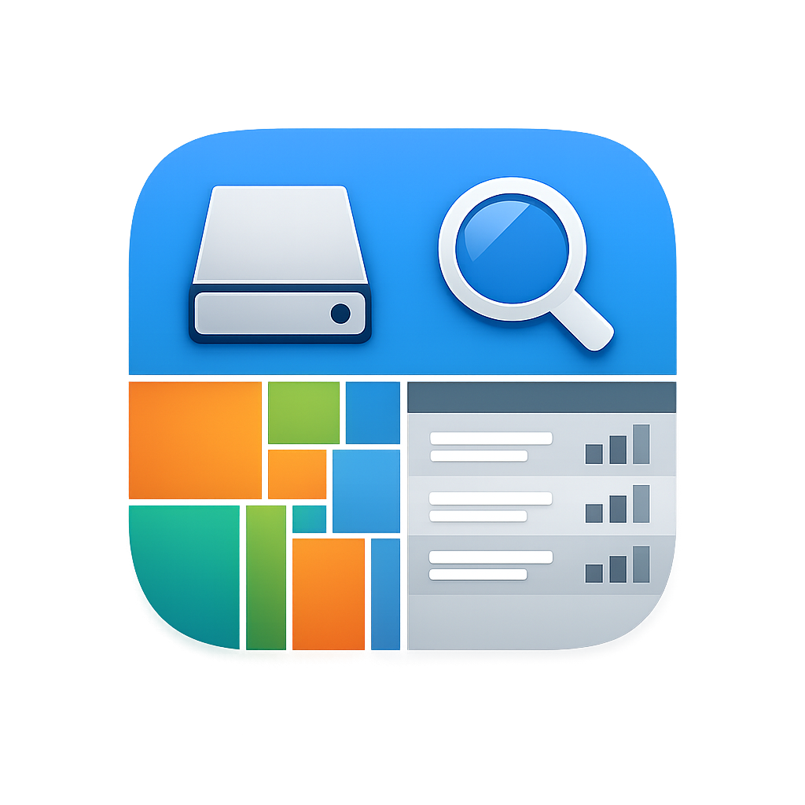
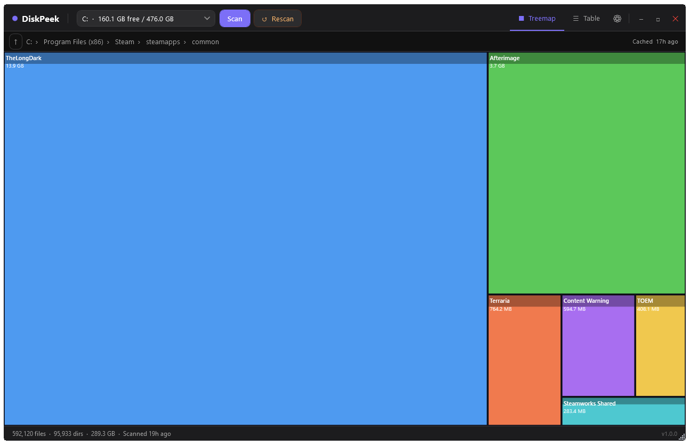
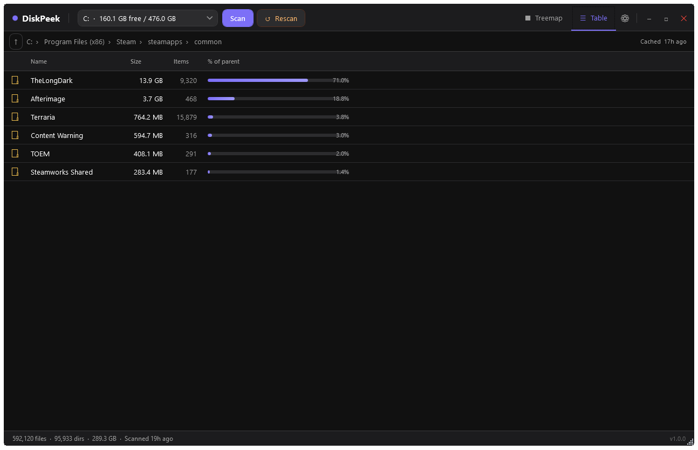
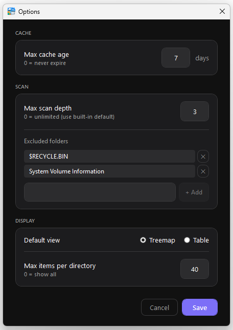

<div align="center">
  
  <h1>DiskPeek</h1>
  <p>A lightweight, native Windows application for visualising disk space usage. Select a drive, run a scan, and instantly see where your storage is going — with an interactive treemap and a sortable table view.</p>

  
  
  
  
</div>

---

## Features

### Visualisation
- **Squarified treemap** — the primary view renders every file and directory as a proportionally sized rectangle. Larger area = more space used. Directories cycle through a 12-colour palette; files use a neutral slate-blue.
- **Sortable table view** — lists all items at the current level with columns for name, size (with a proportional bar), item count, and percentage of parent. Click any column header to sort.
- **Toggle between views** at any time using the Treemap / Table buttons in the toolbar.

### Navigation
- **Drill-down** by double-clicking any directory in the treemap or table.
- **Breadcrumb bar** — shows the full path to the current directory; click any segment to jump back up to that level.
- **↑ Up button** — navigate to the parent directory in one click.

### Scanning & Caching
- **Scan progress** — an animated bar at the top of the window and a live path display in the status bar show what is being scanned.
- **Scan cache** — results are saved as JSON in `%LOCALAPPDATA%\DiskPeek\cache\`. Re-opening the app and selecting the same drive loads instantly from cache.
- **↺ Rescan** — one click discards the cache and re-scans from disk.
- **Cancel** — a ✕ button stops any running scan immediately.
- **Stale cache warning** — if the cached data is older than a configurable threshold (default: 7 days), a banner appears with the option to rescan or dismiss.

### Lazy / Incremental Scanning
- The initial scan builds the full tree to **4 levels** of depth. Size totals are always accurate — `ComputeSizeOnly` recurses the entire subtree at the depth boundary without building nodes.
- Directories at the boundary are shown as **partial** — a dotted border and a `···` badge signal that deeper data is not yet loaded.
- Drilling into a partial directory triggers an on-demand deeper scan (+3 levels), which patches the node in-place so the view updates seamlessly.
- Cache is re-saved silently after each deeper scan.

### Settings
- **Excluded folders** — specify folder names to skip during scanning (default: `$RECYCLE.BIN`, `System Volume Information`).
- **Cache max age** — number of days before a cached result is considered stale.
- **Max scan depth** — override the built-in 4-level initial depth.
- **Default view** — choose whether Treemap or Table opens first after each scan.
- **Max items per directory** — cap the number of children shown in both views to the top-N by size (0 = show all).
- **Column widths** — the table's column widths are remembered between sessions.

### Other
- **Hover tooltips** — hovering a treemap block shows the name, formatted size, and file count.
- **Status bar** — after a scan shows total file count, directory count, total size, and time since scan.
- **PerMonitorV2 DPI awareness** — declared via app manifest; renders crisp on high-DPI displays.
- **Zero NuGet dependencies** — uses only the .NET BCL and WPF; keeps the binary small and startup fast.

---

## Screenshots

<div align="center">

**Treemap view** — directories in colour, files in slate-blue, proportional to size.



**Table view** — click any column header to sort.



**Options dialog** — configure cache age, excluded folders, scan depth, default view, and display limits.



</div>

---

## Requirements

- Windows 10 or 11 (x64)
- [.NET 8 Desktop Runtime](https://dotnet.microsoft.com/download/dotnet/8.0)

---

## Getting Started

### Build from source

```bash
git clone https://github.com/youruser/diskpeek.git
cd diskpeek
dotnet build -c Release
```

Executable output:

```
bin\Release\net8.0-windows\DiskPeek.exe
```

### Run directly (development)

```bash
dotnet run
```

---

## Usage

1. **Select a drive** from the drop-down in the toolbar. The label shows free space and total capacity.
2. Click **Scan** to start. A progress bar and the currently scanned path appear while scanning.
3. The **treemap** (or **table**, depending on your default view setting) appears when the scan completes.
4. **Drill down** by double-clicking any directory block in the treemap, or any directory row in the table.
5. Navigate back using the **breadcrumb bar** or the **↑ Up** button.
6. Click **↺ Rescan** to force a fresh scan and discard the cache.
7. Open **⚙ Options** to configure scan behaviour, cache rules, and display limits.

### Cache

Results are cached in:

```
%LOCALAPPDATA%\DiskPeek\cache\
```

One `.json` file is stored per scanned path. The breadcrumb bar shows how old the cached data is. If the cache exceeds the configured max age, a warning banner appears at the top of the content area.

---

## Keyboard & Mouse

| Action | How |
|---|---|
| Drill into directory | Double-click block (treemap) or row (table) |
| Go up one level | ↑ button, or click a breadcrumb segment |
| Switch views | Treemap / Table toggle buttons in the toolbar |
| Cancel scan | ✕ button (visible while scanning) |
| Sort table | Click any column header |
| Open settings | ⚙ button (top-right of toolbar) |

---

## Project Structure

```
DiskPeek.csproj
app.manifest                          ← PerMonitorV2 DPI awareness
App.xaml / App.xaml.cs               ← global dark theme, styles, converters
MainWindow.xaml / MainWindow.xaml.cs
│
├── Models/
│   ├── FileSystemNode.cs             ← recursive tree model (serialisable)
│   └── AppSettings.cs               ← scan/cache/display configuration model
│
├── Services/
│   ├── DiskScannerService.cs         ← async recursive scanner; lazy depth support
│   ├── CacheService.cs               ← JSON read/write to %LOCALAPPDATA%
│   ├── SettingsService.cs            ← loads/saves AppSettings
│   └── UserSettingsService.cs        ← loads/saves per-user UI state (column widths)
│
├── ViewModels/
│   ├── MainViewModel.cs              ← MVVM hub; commands, navigation, breadcrumbs
│   └── OptionsViewModel.cs           ← options dialog state and save/cancel commands
│
├── Controls/
│   └── TreemapControl.cs             ← custom DrawingVisual treemap renderer
│
├── Views/
│   └── OptionsWindow.xaml            ← settings dialog (cache, scan, display)
│
└── Converters/
    └── Converters.cs                 ← FileSizeConverter, TypeIconConverter, etc.
```

---

## Design Decisions

| Decision | Rationale |
|---|---|
| **WPF + `DrawingVisual`** for the treemap | Avoids layout overhead for hundreds of rectangles; full control over rendering |
| **Squarified treemap algorithm** | Minimises aspect ratios of blocks, making labels and size comparisons readable |
| **Lazy scanning with `ComputeSizeOnly`** | Sizes are always accurate even for unvisited subtrees, without the cost of building the full node tree upfront |
| **`System.Text.Json`** for cache | No extra dependencies; built into the BCL |
| **`CollectionViewSource`** for the table | Gives free column-header sorting without custom code |
| **Separate `UserSettings`** | Keeps UI preferences (column widths, display limits) independent of scan configuration |
| **No NuGet packages** | Keeps the binary small and startup fast |

---

## Licence

MIT — see [LICENSE](LICENSE) for details.
